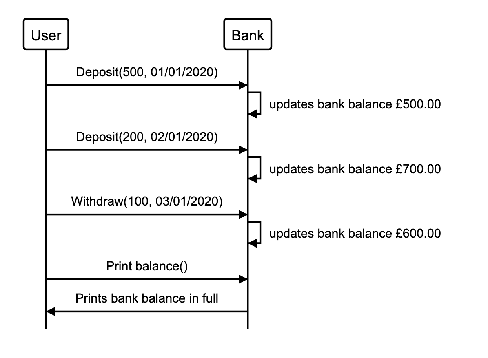

# Bank Technical Test #

## My approach ## 

My approach was to break the brief into user stories. There seems to be one clear object in the brief - a Bank. This will be my main object. 

Within this bank, users should be able to do three things 
- Deposit 
- Withdraw
- Print statement

For Deposits and Withdrawals, a user should be able to insert a number, that will either add or detract from the 'Bank Balance' (the balance should be an instance variable so that is can be constantly updated). In addition to the balance, the date of each deposit or withdrawal should also be taken into account and updated through another instance variable 'Date'.

Each time the user interacts with the bank, an element will be added to the 'bank statement' this should be an array so that it can hold a 2D array. On the first level of the array, this will be each interaction with the bank (withdrawals and deposits). On the second level for line, there should be 4 elements which stores a date, credit amount, debit amount and a snapshot of the balance at that point in time - these four components will make up the bank statement.

The function print statement will introduce headings "date, credit, debit and balance", as well as reversing the array so that the most recent activity is at the top. Below that, the itemized lines of the bank history - this is the generateStatement() function. 

## To run the project: ##

Please open this up on a browser CLI e.g Google Chrome dev tools.

`$ var bank = new Bank` Initialize the bank object\
`$ bank.deposit(100)`  Deposit into the bank\
`$ bank.deposit(50)` Withdraw from the bank\
`$ bank.printStatement()` Print bank statement\

## To run tests ##
Please open `SpecRunner.html` on a browser

## Requirements ##
You should be able to interact with your code via a REPL like IRB or the JavaScript console. (You don't need to implement a command line interface that takes input from STDIN.)
Deposits, withdrawal.
Account statement (date, amount, balance) printing.
Data can be kept in memory (it doesn't need to be stored to a database or anything).

## Acceptance Criteria ##
- Given a client makes a deposit of 1000 on 10-01-2012
- And a deposit of 2000 on 13-01-2012
- And a withdrawal of 500 on 14-01-2012
- When she prints her bank statement
- Then she would see

date       |  credit |  debit | balance
|   ---    |    ---  |  ---   |   ---   |
14/01/2012 |         | 500.00 | 2500.00
13/01/2012 | 2000.00 |        | 3000.00
10/01/2012 | 1000.00 |        | 1000.00

## User Stories: ##

- As a user
So that I can add money to my bank account
I would like to deposit cash into my bank account 

- As a user
So that I can use cash to spend
I would like to withdraw cash from my bank account

- As a user
So that I can see how much cash I have
I would like to be able to print my bank statement

- As a user
So that I can see what dates my deposits were made
I would like to be able to see the dates on my bank statement

## Domain modelling ##

|  Object    |   Name    | Purpose |
|   ---      |    ---    |   ---   |
| Class      | Bank      |         | 
|            | Deposit() | To add to total bank balance |
|            | Withdraw()| To minus from bank balance  |
|            | Print()   | To print the history of withdrawals/deposits |

# User flow #

